<h1 align="center">Rupak Kumar</h1>
<h3 align="center">AI Engineer · LLM Applications · Deep Learning · ML Systems</h3>

---

### 💫 About

I build AI systems end to end — LLM-powered applications, agent tooling, and deep learning models that run behind real APIs instead of staying in notebooks.

Recent work includes a Gemini-powered resume analyzer served through FastAPI, an MCP server that exposes GitHub as structured tools to AI assistants, and a six-architecture benchmark for real-time sign language recognition.

- 🔭 Currently building LLM applications and agent tooling on top of the Model Context Protocol
- 🌱 Deepening my work in deep learning, model evaluation, and getting models into production
- 🎯 Open to **AI / ML Engineering internships**
- 📫 Reach me at **rupakkumar76319@gmail.com**

---

### 🚀 Featured Projects

| Project | What it does | Stack |
|---|---|---|
| [**ATS Resume Analyzer**](https://github.com/rupakkumar-76319/ATS-Resume-Analyzer) | FastAPI service that parses PDF/DOCX resumes and scores them against a target job description using **Gemini 2.5 Flash**. Containerized with Docker. | FastAPI · Gemini API · Docker |
| [**GitHub Intelligence MCP Server**](https://github.com/rupakkumar-76319/GitHub-Intelligence-MCP-Server) | MCP server exposing GitHub as structured tools for AI assistants — repository analysis, issue management, and pull request insights. | Python · FastMCP · httpx |
| [**Sign Language Recognition**](https://github.com/rupakkumar-76319/Sequence-Based-Hand-Gesture-Recognition-For-Sign-Language-Using-Deep-Learning) | Real-time ASL recognition with MediaPipe Hands. Benchmarked 6 architectures (LSTM, GRU, BiLSTM, CNN, CNN-GRU, CNN-BiLSTM) across 36 classes — **92.68%** best accuracy, **0.11s** fastest inference. | TensorFlow · Keras · MediaPipe |
| [**Weathercast ML System**](https://github.com/rupakkumar-76319/weathercast-ml-systems_Full) | End-to-end next-day rainfall prediction — preprocessing, training, evaluation, and a served web interface for live predictions. | scikit-learn · XGBoost · Flask |

Also on my profile: an [algorithmic trading backtester](https://github.com/rupakkumar-76319/algorithmic_trading_backtester) (moving-average crossover, Sharpe ratio, drawdown) and an [e-commerce sales analysis](https://github.com/rupakkumar-76319/E-Commerce-Sales-Analysis-UCI-Online-Retail-Dataset-2010-2011-) over ~500K UK retail transactions.

📌 [Browse all repositories →](https://github.com/rupakkumar-76319?tab=repositories)

---

### 💻 Tech Stack

**Core — what I build with**

**Familiar — coursework and side work**

---

### 🎓 Education

- **B.Tech, Electronics & Communication Engineering** — Assam University, Silchar *(ongoing)*
- **BS, Data Science and Applications** — Indian Institute of Technology Madras *(ongoing)*

---

### 📊 GitHub Stats

